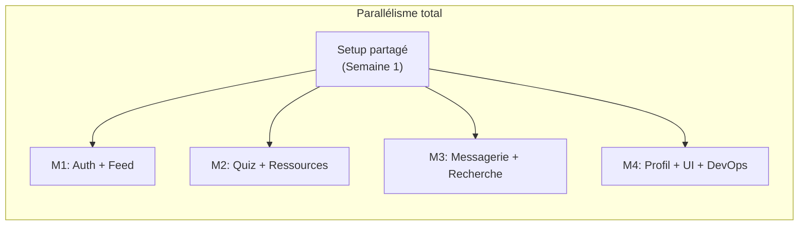
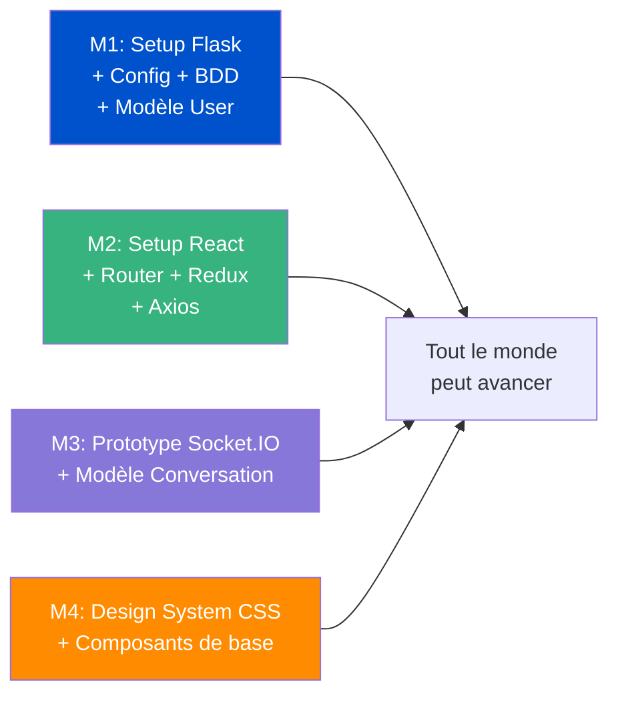

# 🎓 TinAMU — Réseau Social Universitaire Informatique

> Plateforme d'entraide entre étudiants en informatique (L1 → M2) avec un système de mise en relation style Tinder, messagerie temps réel, quiz gamifiés et partage de ressources.

## 🛠 Stack technique

| Couche | Technologies |
|--------|-------------|
| **Frontend** | React (Vite) + Redux Toolkit + React Router + Axios |
| **Backend** | Flask + Flask-JWT-Extended + Flask-SQLAlchemy + Flask-Migrate + Flask-SocketIO |
| **Base de données** | PostgreSQL |
| **Déploiement** | Docker + Docker Compose |

## 📁 Structure du projet

```
tinamu/
├── frontend/              # Application React (Vite)
│   ├── src/
│   │   ├── components/    # Composants réutilisables
│   │   ├── pages/         # Pages (Feed, Quiz, Messages, Profil, Recherche, Ressources)
│   │   ├── store/         # Redux slices
│   │   ├── services/      # Appels API (Axios)
│   │   └── socket/        # Socket.IO client
│   └── public/
│
└── backend/               # API Flask
    ├── app/
    │   ├── models/        # Modèles SQLAlchemy
    │   ├── routes/        # Blueprints Flask
    │   ├── services/      # Logique métier
    │   ├── sockets/       # Événements Socket.IO
    │   └── utils/
    ├── config.py
    ├── seed.py
    └── run.py
```

## 🚀 Installation

### Backend
```bash
cd backend
python -m venv venv
source venv/bin/activate
pip install -r requirements.txt
flask db upgrade
python seed.py
flask run
```

### Frontend
```bash
cd frontend
npm install
npm run dev
```

### Docker (production)
```bash
docker-compose up --build
```

---

# 📅 Répartition des tâches — Tranches verticales (Full-Stack par feature)

## Principe

Chaque membre gère le **backend ET le frontend** de ses modules. Personne n'attend personne.



| Membre | Modules (Back + Front) | Stack |
|--------|----------------------|-------|
| **M1** | 🔐 Auth + 🃏 Feed Tinder (Swipe/Match) | Flask routes + React pages |
| **M2** | 🧠 Quiz + 📚 Ressources | Flask routes + React pages |
| **M3** | 💬 Messagerie (3 types) + 🔍 Recherche | Flask routes + Socket.IO + React pages |
| **M4** | 👤 Profil + 🎨 Design System + 🐳 DevOps | Flask routes + React pages + Docker |

> **⚠️ Semaine 1 du Sprint 1** est commune : M1 fait le setup Flask + modèles de base, M2 fait le setup React. Après ça, **chacun est autonome** sur ses modules.

---

## Sprint 1 — Fondations (2 semaines)

### Semaine 1 : Setup commun (tout le monde contribue)



| Jour | M1 🔐 | M2 🧠 | M3 💬 | M4 🎨 |
|------|--------|--------|--------|--------|
| **J1** | 🟢 Structure Flask, config, extensions | 🟢 `npx create-vite`, React Router | 🟢 Recherche Socket.IO, prototype | 🟢 Palette couleurs, typo (Google Fonts) |
| **J2** | 🟢 PostgreSQL, SQLAlchemy, `flask db init` | 🟢 Redux Toolkit store, Axios service | 🟢 Flask-SocketIO setup serveur | 🟢 Composants : Button, Input, Card |
| **J3** | 🟢 Modèle `User`, `Follow`, migrations | 🟢 Layout : Navbar, Sidebar, routing | 🟢 Modèle `Conversation`, `Message` | 🟢 Composants : Modal, Badge, Loader |
| **J4** | 🟢 `seed.py` (données test) | 🟢 Auth slice Redux, guards de route | 🟢 Modèle `ConversationMember` | 🟢 Mode sombre / clair |
| **J5** | 🟢 Documentation API.md | ⚡ Merge → vérifier que tout tourne | ⚡ Merge → tester avec seed | ⚡ Merge → intégrer dans layout |

> **💡 Fin de semaine 1** : tout le monde merge dans `main`. On doit avoir un squelette fonctionnel : Flask qui tourne + React qui tourne + les modèles User + Conversation en BDD.

### Semaine 2 : Chacun commence son module

| Jour | M1 🔐 Auth | M2 🧠 Quiz | M3 💬 Messagerie | M4 👤 Profil |
|------|------------|------------|------------------|--------------|
| **J6-7** | Routes Auth (register, login, JWT) | Modèles Quiz, Question, Option | Routes REST conversations | Page Login (front) |
| **J8-9** | Page Login + connexion API | Modèle QuizResult, migrations | Events Socket.IO (join, send) | Page Profil (front, stats mock) |
| **J10** | Test login E2E ✅ | Test modèles ✅ | Test envoi message ✅ | Test login+profil ✅ |

---

## Sprint 2 — Features principales (2 semaines)

```mermaid
graph LR
    subgraph "M1 — Feed Tinder"
        M1a["Modèles Post, Swipe, Match"] --> M1b["Routes CRUD Posts"]
        M1b --> M1c["Routes Feed + Swipe"]
        M1c --> M1d["Page Feed React<br/>(react-tinder-card)"]
        M1d --> M1e["Logique Match<br/>→ crée conversation"]
    end

    subgraph "M2 — Quiz"
        M2a["Routes CRUD Quiz"] --> M2b["Routes Questions/Options"]
        M2b --> M2c["Routes Gameplay<br/>(start/submit/score)"]
        M2c --> M2d["Page Quiz React<br/>(QCM + Timer Challenge)"]
    end

    subgraph "M3 — Messagerie"
        M3a["Routes messages REST"] --> M3b["Socket.IO temps réel"]
        M3b --> M3c["Page Chat React"]
        M3c --> M3d["3 types conversations"]
    end

    subgraph "M4 — Profil + Recherche"
        M4a["Routes Profil/Stats"] --> M4b["Routes Recherche users"]
        M4b --> M4c["Page Recherche React"]
        M4c --> M4d["Page Profil connectée"]
    end

    style M1a fill:#0052CC,color:#fff
    style M1b fill:#0052CC,color:#fff
    style M1c fill:#0052CC,color:#fff
    style M1d fill:#0052CC,color:#fff
    style M1e fill:#0052CC,color:#fff
    style M2a fill:#36B37E,color:#fff
    style M2b fill:#36B37E,color:#fff
    style M2c fill:#36B37E,color:#fff
    style M2d fill:#36B37E,color:#fff
    style M3a fill:#8777D9,color:#fff
    style M3b fill:#8777D9,color:#fff
    style M3c fill:#8777D9,color:#fff
    style M3d fill:#8777D9,color:#fff
    style M4a fill:#FF8B00,color:#fff
    style M4b fill:#FF8B00,color:#fff
    style M4c fill:#FF8B00,color:#fff
    style M4d fill:#FF8B00,color:#fff
```



| Jour | M1 🃏 Feed | M2 🧠 Quiz | M3 💬 Chat | M4 🔍 Profil+Recherche |
|------|-----------|------------|-----------|----------------------|
| **J1-2** | Modèles Post/Swipe/Match + migrations | Routes CRUD Quiz + Questions | Routes REST messages (paginé) | Routes Profil (stats agrégées) |
| **J3-4** | Routes CRUD Posts | Routes Gameplay (start/submit/score) | Socket.IO : join, send, typing | Routes Recherche (filtrée) |
| **J5-6** | Routes Feed (algo) + Swipe | Page Quiz React (QCM interactif) | Page Messagerie React (liste + chat) | Page Recherche React |
| **J7-8** | Page Feed React (swipe cards) | Timer Challenge + résultats | 3 types de conversations (UI) | Page Profil connectée à l'API |
| **J9-10** | Logique Match → auto-créer conv M3 | Leaderboard + création quiz | Test chat temps réel E2E | Graphique radar (recharts) |

> **⚠️ Seule dépendance inter-membres** au Sprint 2 : quand M1 crée un **Match**, il doit créer une `Conversation` (table de M3). Solution : M3 expose une **fonction utilitaire** `create_private_conversation(user1_id, user2_id)` que M1 importe.

```python
# backend/app/services/conversation_service.py (M3 écrit ça)
def create_private_conversation(user1_id, user2_id):
    conv = Conversation(type='PRIVEE', created_by=user1_id)
    db.session.add(conv)
    db.session.flush()
    db.session.add(ConversationMember(conversation_id=conv.id, user_id=user1_id, role='MEMBRE'))
    db.session.add(ConversationMember(conversation_id=conv.id, user_id=user2_id, role='MEMBRE'))
    db.session.commit()
    return conv

# backend/app/services/feed_service.py (M1 l'utilise)
from app.services.conversation_service import create_private_conversation
```

---

## Sprint 3 — Intégration + Ressources (2 semaines)

| Jour | M1 🃏 | M2 📚 | M3 💬 | M4 🐳 |
|------|-------|-------|-------|-------|
| **J1-3** | Animation match + notification | **Modèles+Routes Ressources** (upload, download, rating) | Groupes perso (CRUD membres) | Responsive toutes les pages |
| **J4-6** | Follow/Unfollow (back+front) | **Page Ressources React** (dropzone, cards, filtres) | Conversations générales (auto-join par niveau) | Micro-animations, skeleton loaders |
| **J7-8** | Bug fixes feed + auth | Bug fixes quiz + ressources | Bug fixes messagerie | Docker (Dockerfile back + front) |
| **J9-10** | 🔗 **Intégration croisée** — tous ensemble | 🔗 Tests E2E scénario complet | 🔗 Tests E2E scénario complet | docker-compose + README |

---

## Sprint 4 — Polish + Démo (1 semaine)

| Jour | Tout le monde ensemble |
|------|----------------------|
| **J1-2** | Bug fixes critiques, tests croisés |
| **J3** | Seed data réaliste pour la démo |
| **J4** | Répétition de la démo |
| **J5** | 🎯 **Démo finale** |

---

## 🔑 Règles de coordination

### 1. Modèles partagés
Le modèle `User` est utilisé par tout le monde. **Convention** :
- M1 est "propriétaire" du modèle `User` (il fait les migrations)
- Si un autre membre a besoin d'ajouter un champ → il fait une MR que M1 review

### 2. Services partagés
Chaque membre expose des **fonctions de service** réutilisables :
```
backend/app/services/
├── auth_service.py         # M1
├── feed_service.py         # M1
├── quiz_service.py         # M2
├── resource_service.py     # M2
├── conversation_service.py # M3
├── message_service.py      # M3
├── search_service.py       # M4
├── profile_service.py      # M4
```

### 3. Convention de branches
```
main
├── setup/flask-config       (M1, Sprint 1 Sem 1)
├── setup/react-config       (M2, Sprint 1 Sem 1)
├── feature/auth             (M1)
├── feature/feed-tinder      (M1)
├── feature/quiz             (M2)
├── feature/resources        (M2)
├── feature/messaging        (M3)
├── feature/search           (M4)
├── feature/profile          (M4)
└── feature/docker           (M4)
```

### 4. Merge quotidien
> Chaque soir, chaque membre merge `main` dans sa branche pour éviter les conflits massifs.

---

## 👥 Membres

| Membre | Rôle |
|--------|------|
| M1 | Auth + Feed Tinder |
| M2 | Quiz + Ressources |
| M3 | Messagerie + Recherche |
| M4 | Profil + UI/UX + DevOps |
